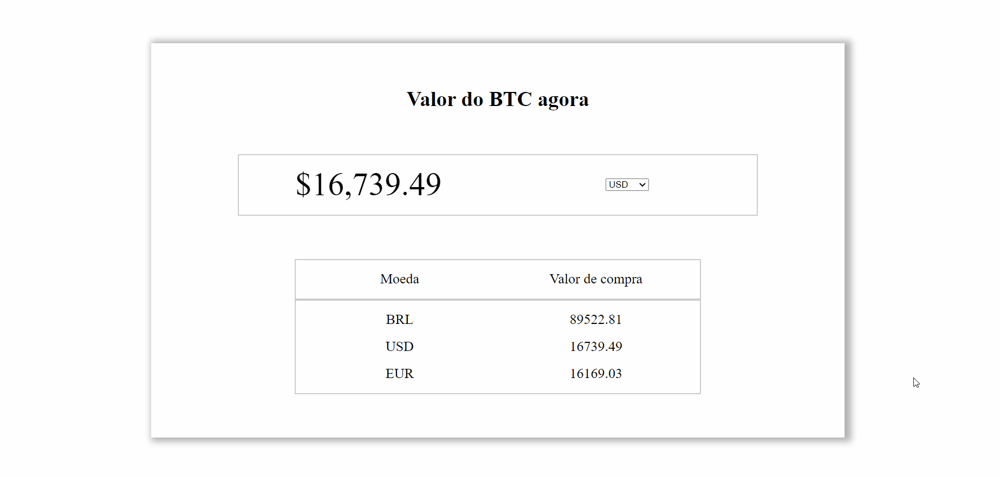

# Readme

<h2 align="center">Preço BTC</h2>

Projeto que consome uma API e verifica o valor do BTC em tempo real em três tipos de moedas, aqui apliquei os conceitos de Json, Promises, Fetch e Then.

## Tabela de conteudo

- [Tecnologia utilizada](#tecnologias)
- [Como utilizar](#utilização)
- [Veja o projeto funcionando.](#funcionando)

   

   <h4 align="center">&#11088 Preço BTC &#11088 </h4>
    

### Características

- [x] Promeses
- [x] Json
- [x] Fetch
- [x] Then

  
  

 
 

 
 ## Tecnologias 
 
 <h2>utilizada</h2> 

- HTML 
- CSS 
- JavaScript 

 

 

## Utilização

Projeto usando apenas tecnologias de fácil utilização não necessita nenhuma instalação.

 

 

   
 

  

## Funcionando

  
Click no botão abaixo e visualize o projeto 

 
  <button  style="padding:8px 20px; border-radius:5px; border:none; background:black;"><a style="color:aqua;" target="_blank" href="https://fernandoroch.github.io/FlexBlog/">Ir para projeto</a>
  </button>
  

   
 

  

### Criado por fernando rocha.

Rede Sociais:

- <a target="_blank"  href="https://www.linkedin.com/feed/?trk=404_page">linkedin</a>
- <a target="_blank"  href="https://www.instagram.com/_daycode_/">Instagram</a>
- <a target="_blank"  href="https://www.tiktok.com/@_daycode_">TikTok</a>
